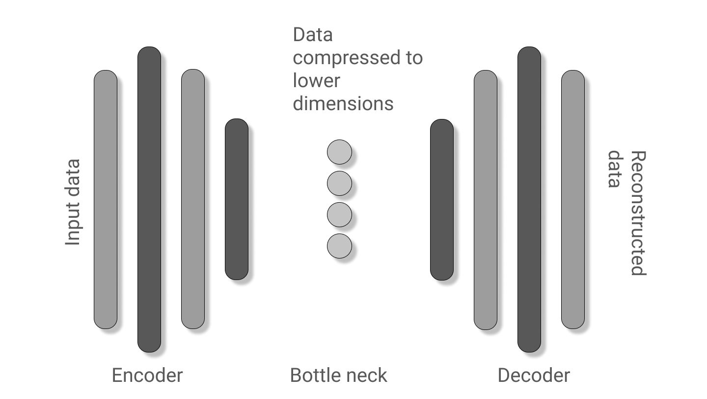

# Auto-Encoders
Deep generative models especially Auto Encoders and VAEs in both TensorFlow and PyTorch. 
Status : Incomplete 

## Auto Encoders basic
- MNIST dataset.
- Flattened images.

#### Model architecture

