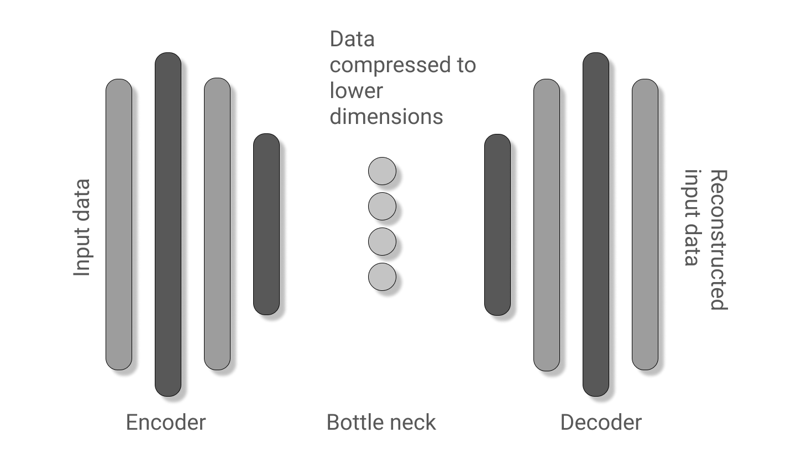

# Auto-Encoders
Deep generative models especially Auto Encoders and VAEs in both TensorFlow and PyTorch. 
Status : Incomplete 

## Auto Encoders Linear
- MNIST dataset.
- Flattened images.
- Refer [auto_encoder_linear_torch.ipynb](./auto_encoder_linear_torch.ipynb) for code.

#### Model architecture

### Insights
- Linear layers in an encoder decoder setup.
- Good for non image data.
- The number of latent space dimensions drastically changes the accuracy of the model.

### Results
- Flattened images of MNIST dataset were used.
- A Semi-supervised learning method was demonstrated in the code mentioned above.
- Accuracy could not get beyond 80 percent when 5 - 10 percent of the test data was labeled.
- Convolutional neural networks may work better than these linear networks.
